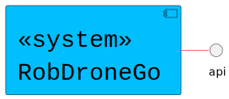

## Logical View - Level 1

------------------------------
In logical view (component diagram), it aims to provide an overview of the structure and organization of the system's architecture.
This is level 1, which is a completely abstract view.
In higher levels, we will be able to see a greater level of granularity.

--------------------------------

