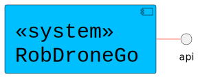
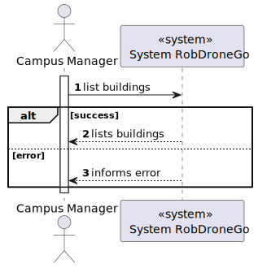
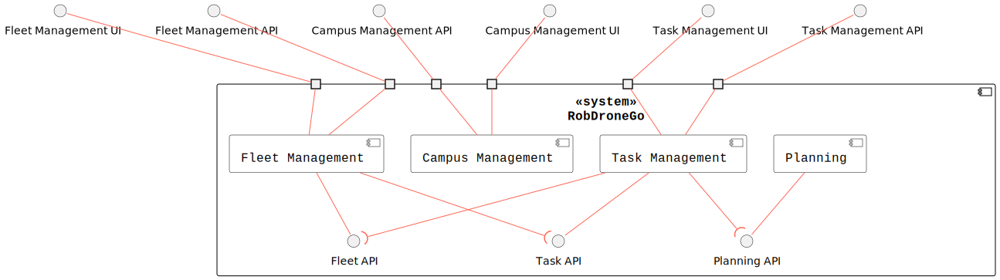
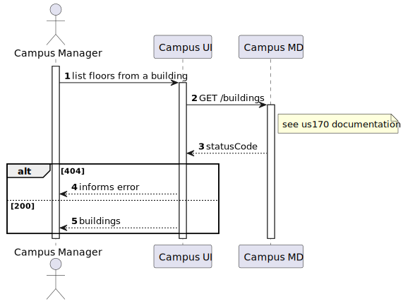
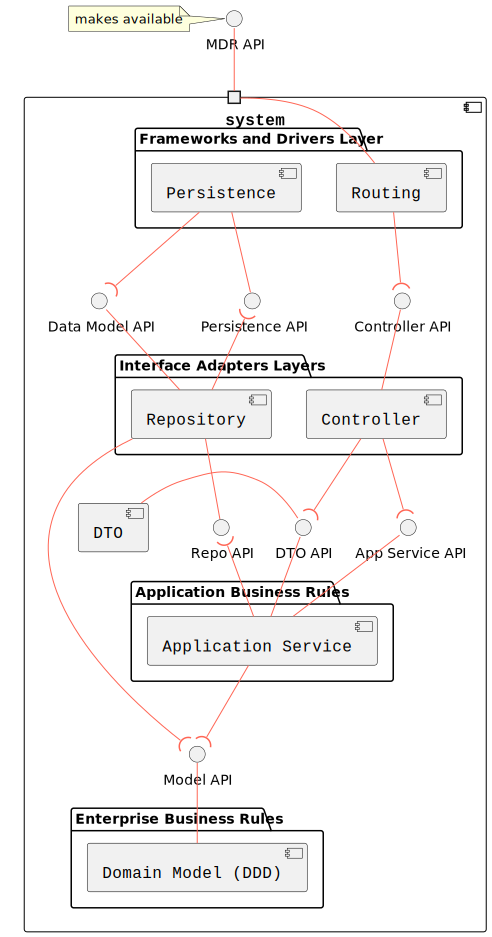
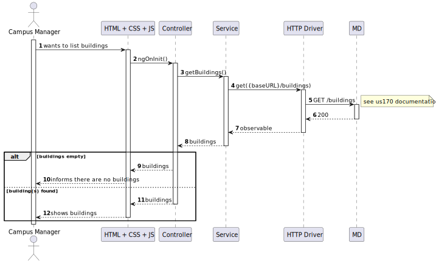
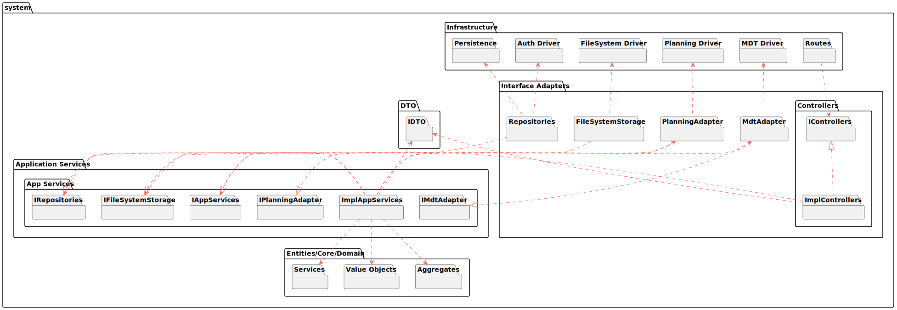

# US1060

## 1. User Story Description

This user story pertains to the functionality of listing buildings

## 2. Customer Specifications and Clarifications

Should present all building specifications with the floors of the building

## 3. Diagrams

### Level 1

- Logical View



- Process View



### Level 2

- Logical View



- Process View



### Level 3

- Logical View



- Process View

 [Work in Progress]

- Implementation View



- Class Diagram

 [Work in Progress]

## 4. Acceptance Criteria and Tests

To successfully fulfill this user story, the following criteria must be met:

- The user interface must effectively present the buildings along with their respective specifications and details.

## 5. Dependencies

This user case relies on [US170](../us170), which exposes the GET route of the backend API

```json
GET /buildings
```

This user case relies on [US210](../us210), which exposes the GET route of the backend API

```json
GET /buildings/buildingCode
```

## 5. Design Patterns

- Dependency inversion: Classes of one layer don't use specific implementations of a class from another layer (aside from domain); instead an interface defines a contract for how communications are made.

- Dependency injection: Since no explicit implementations are used, an injection mechanism takes care of deciding, at runtime, which implementation to use based on a configuration file.

- Single Responsibility (partially) - for each domain entity, there is a dedicated controller, service, repository (interface) definition that deals with/processes/handles operations related to that domain entity, and no other.
  - The reason it is a partial use lies in the fact that each controller/service could be broken down by use case rather than by entity

- DTO: DTO's are used to transfer information between the different layers
