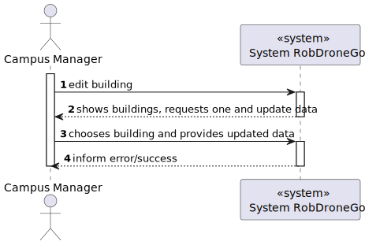
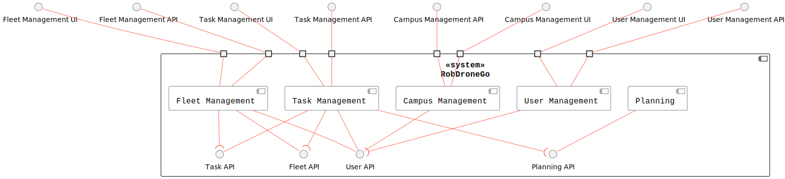
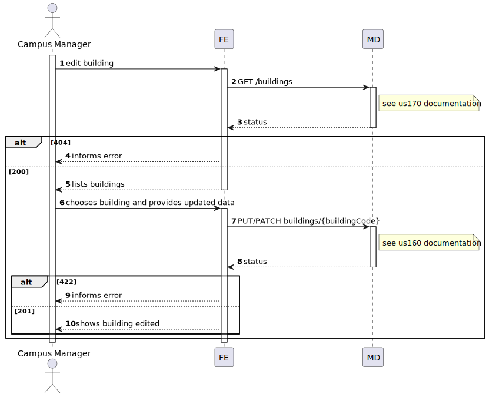
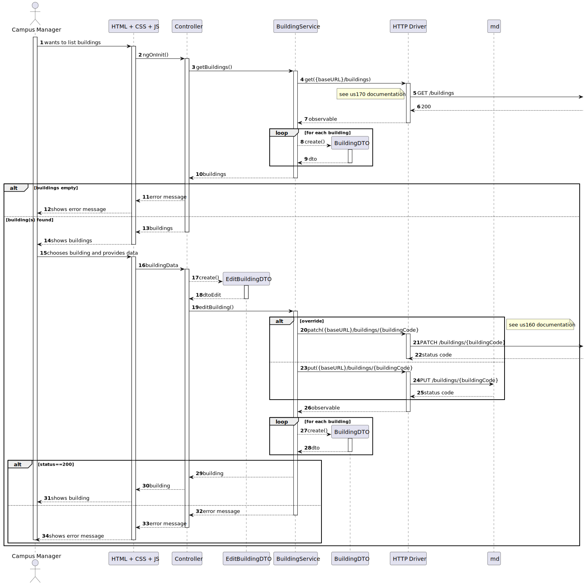

# US1070

## 1. User Story Description

This user story pertains to the functionality of edit buildings.

## 2. Customer Specifications and Clarifications

The customer has outlined that all the building specifications edition can either be partially editing the building, or completly replace the building, always preserving the building's code

## 3. Diagrams

### Level 1

- Logical View


- Process View



### Level 2

- Logical View



- Process View



### Level 3

- Logical View


- Process View

 [Work in Progress]

- Implementation View


- Class Diagram

 [Work in Progress]

## 4. Acceptance Criteria and Tests

To successfully fulfill this user story, the following criteria must be met:

- The user interface should present available buildings and prompt the user to select the desired building to edit.
- After selecting the building, the user interface should display the respective specifications to be edited.
- Present the user with the option to completly override the building chosen

## 5. Dependencies

This user case relies on :

- [US170](../us170), Used to retrieve a list of every available building

```json
GET /buildings
```

- [US160](../us160), which exposes the following PUT and PATCH routes of the backend API

```json
PUT /buildings/{buildingCode}
PATCH /buildings/{buildingCode}
```

## 5. Design Patterns

- Dependency inversion: Classes of one layer don't use specific implementations of a class from another layer (aside from domain); instead an interface defines a contract for how communications are made.

- Dependency injection: Since no explicit implementations are used, an injection mechanism takes care of deciding, at runtime, which implementation to use based on a configuration file.

- Single Responsibility (partially) - for each domain entity, there is a dedicated controller, service, repository (interface) definition that deals with/processes/handles operations related to that domain entity, and no other.
  - The reason it is a partial use lies in the fact that each controller/service could be broken down by use case rather than by entity

- DTO: DTO's are used to transfer information between the different layers
