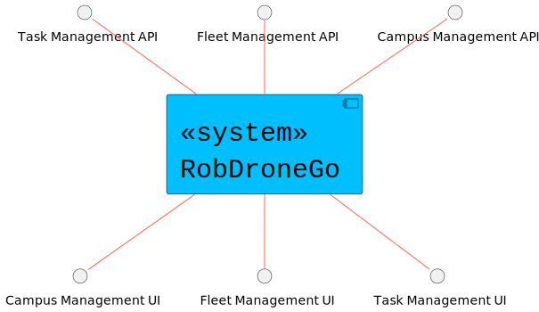
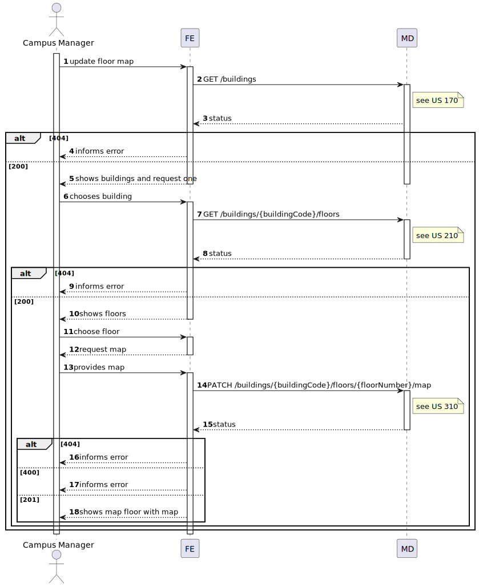
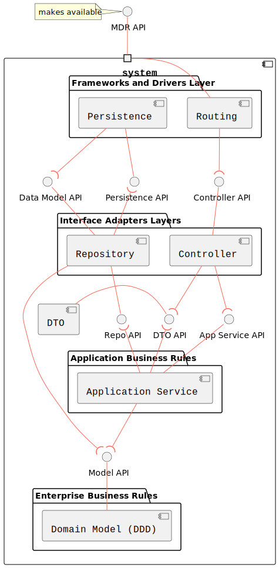
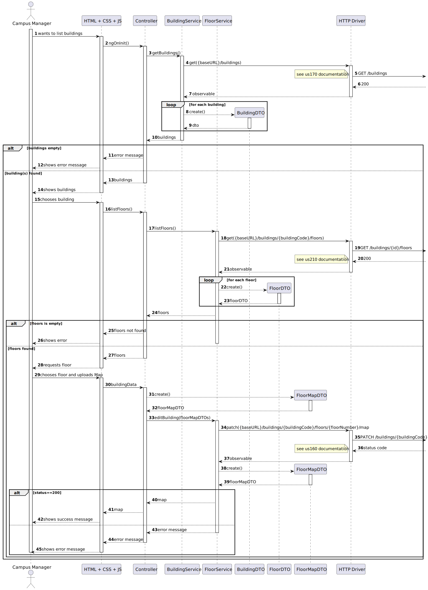
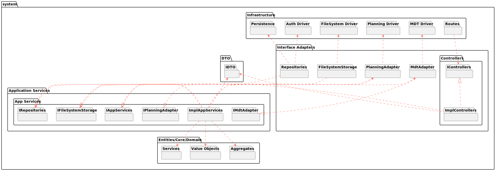

# US1210

## 1. User Story Description

This user story pertains to the functionality of upload a map on a given floor.

## 2. Customer Specifications and Clarifications

The customer has outlined that each room should be of a category (Office, Amphitheater, Laboratory or Other)

## 3. Diagrams

### Level 1

- Logical View



- Process View


### Level 2

- Logical View


- Process View



### Level 3

- Logical View



- Process View

 [Work in Progress]

- Implementation View



- Class Diagram

 [Work in Progress]

## 4. Acceptance Criteria and Tests

To successfully fulfill this user story, the following criteria must be met:

- The user interface should present available buildings and prompt the user to select the desired building.
- After selecting the building, the user interface should present available floors and prompt the user to select the desired floors.
- After selecting the floors, the user interface should display the respective specifications to create a room.
- The user interface must allows the user to select a room category from the ones specified by the client
- Inform the user about operation success, showing the room specifications.

## 5. Dependencies

This user case relies on :

- [US310](../us310), Used to retrieve a list of every available building

```json
GET /buildings
```

- [US210](../us210), Used to retrieve a list of every available floor of a building

```json
GET /buildings/{buildingCode}/floors
```

- [US310](../us310), Used to retrieve create a new floor on floor corresponding the floorNumber and the buildingCode

```json
POST /buildings/{buildingCode}/floors/{floorNumber}/rooms
```

## 5. Design Patterns

- Dependency inversion: Classes of one layer don't use specific implementations of a class from another layer (aside from domain); instead an interface defines a contract for how communications are made.

- Dependency injection: Since no explicit implementations are used, an injection mechanism takes care of deciding, at runtime, which implementation to use based on a configuration file.

- Single Responsibility (partially) - for each domain entity, there is a dedicated controller, service, repository (interface) definition that deals with/processes/handles operations related to that domain entity, and no other.
  - The reason it is a partial use lies in the fact that each controller/service could be broken down by use case rather than by entity

- DTO: DTO's are used to transfer information between the different layers
