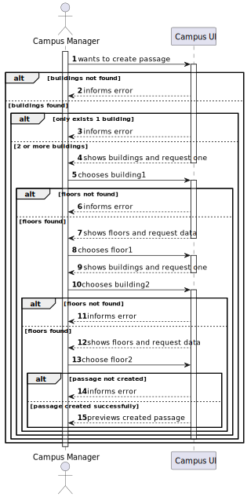
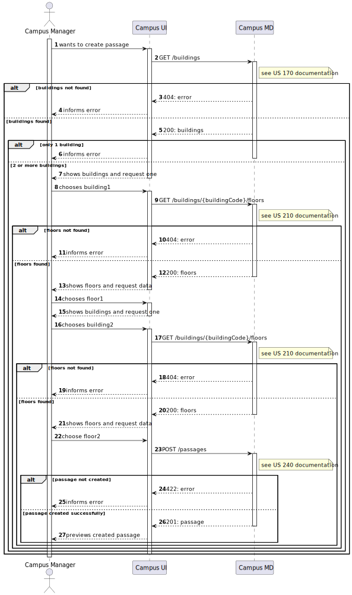
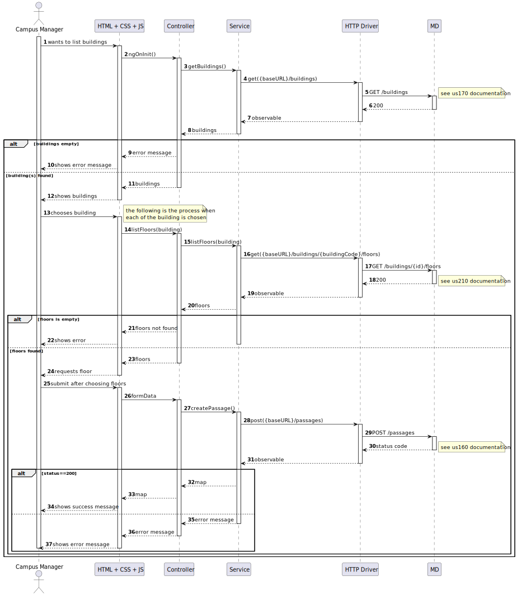

# US1170

## 1. User Story Description

This user story pertains to the functionality of create passage between 2 buildings.

## 2. Customer Specifications and Clarifications

The customer has outlined that,a passage can only be created between 2 different buildings

## 3. Diagrams

### Level 1

- Logical View


- Process View



### Level 2

- Logical View


- Process View



### Level 3

- Logical View


- Process View

 [Work in Progress]

- Implementation View


- Class Diagram

 [Work in Progress]

## 4. Acceptance Criteria and Tests

To successfully fulfill this user story, the following criteria must be met:

- There must be at least 2 buildings to create a passage
- The user interface should present available buildings and prompt the user to select the desired building to edit.
- After selecting the building, the user interface should display the respective floors, and propmt the user to select the desired floor to be part of the passage
- repeat the process without showing the user the building previously choosed

## 5. Dependencies

This user case relies on :

- [US170](../us170), Used to retrieve a list of every available building

```json
GET /buildings
```

- [US160](../us210), which exposes the following PUT and PATCH routes of the backend API

```json
GET /buildings/{buildingCode}/floors
```

- [US240](../us240), which exposes the following POST route of the backend API

```json
POST /passages
```

## 5. Design Patterns

- Dependency inversion: Classes of one layer don't use specific implementations of a class from another layer (aside from domain); instead an interface defines a contract for how communications are made.

- Dependency injection: Since no explicit implementations are used, an injection mechanism takes care of deciding, at runtime, which implementation to use based on a configuration file.

- Single Responsibility (partially) - for each domain entity, there is a dedicated controller, service, repository (interface) definition that deals with/processes/handles operations related to that domain entity, and no other.
  - The reason it is a partial use lies in the fact that each controller/service could be broken down by use case rather than by entity

- DTO: DTO's are used to transfer information between the different layers
