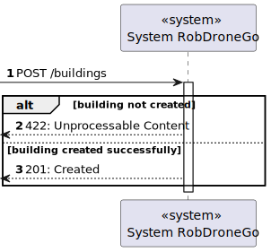
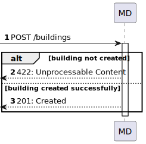
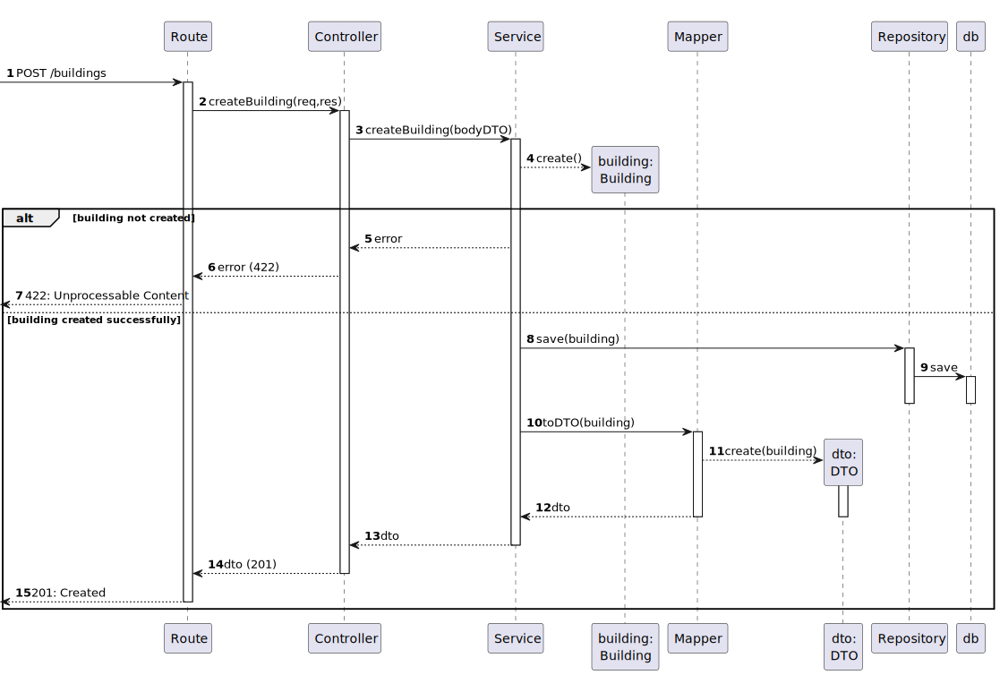

# US 150 - Create building

### 1. User Story Description

As an administrator, I intend to create a building.

### 2. Customer Specifications and Clarifications

**From the specifications document:**

**From the client clarifications:**

> **Question:** Caro cliente,
Relativamente à criação de edifícios é suposto criar-mos um edifício sem nenhum piso inicialmente e depois adicionarmos os pisos?
Por exemplo: Criar o edifício A apenas, sem nenhum piso, e só depois na US 190 criar-mos os respetivos pisos do edifício A.
Ou é necessário sempre que criarmos um edifício especificar os pisos que o mesmo tem?
Por exemplo: Criar o edifício A, com os pisos A1, A2, A3 com as dimensões da grelha para cada um dos pisos.
Os melhores cumprimentos,
Grupo 002.

> **Answer:** boa tarde,
são dois requisitos independentes. 150 apenas define o edificio. posteriormente o utilizador invocará o caso de uso correspondete ao requisito 190 para criar cada piso desse edificio

> **Question:**  Em relação à breve descrição, existe alguma regra em particular?

> **Answer:** bom dia é opcional, com o máximo de 255 caracteres

> **Question:** Caro cliente,
Será possível esclarecer como funcionarão estas user stories? Com a 230 (Carregar mapa do piso) o nosso entendimento foi que as células seriam carregadas já com a criação de salas e pisos, e assim sendo não faria sentido as outras duas user stories, onde é pedido para criar um piso de um edifício e uma sala. Não entendemos o que é pretendido  com as us's 190 e 310.
Atentamente,
Grupo 63

> **Answer:** boa tarde,
o requisito 150 Criar edificio permite criar um edificio, exemplo, edificio "B", com um nome opcional e com uma breve descrição (ex., "departamento de engenharia informática") indicando a dimensão máxima de cada piso em termos de células (ex., 10 x 10)
o requisito 190 Criar piso permite definir um piso para um dos edificios criados anteriormente, por exemplo, o piso 1 do edificio B com uma breve descrição (ex., "salas TP")
o requisito 230 Carregar mapa de piso permite ao utlizador fazer upload de um ficheiro descrevendo o mapa de um dado piso. esse ficheiro deve ser validado se tem a estrutura correta e se obdece ao tamanho máximo definido aquando da criação do edificio
o requisito 310 Criar sala permite definir um sala num dado piso de um edificio, exemplo sala "B310" no 3º piso do edificio B, com uma categorização dessa sala (Gabinete, Anfiteatro, Laboratório, Outro) e uma breve descrição, ex., "Laboratório de Engenharia de Qualidade"

### 3. Diagrams

### 4. HTTP

### 4.1 HTTP Requests

|     Method     |    HTTP request     |                           Description                            |
|:--------------:|:-------------------:|:----------------------------------------------------------------:|
| createBuilding | **POST** /buildings | Building Route calls method createBuilding in buildingController |

### 4.2 HTTP Response
|  Status code  |       Description       |
|:-------------:|:-----------------------:|
|    **201**    |         Created         |
|    **422**    |  Unprocessable Content  |

### 4.3 Authorization

No authorization required

### 4.4 HTTP Request Body

[HTTP REQUEST BODY](./README/test.buildings.txt)

### 4.5 Simulation HTTP requests

