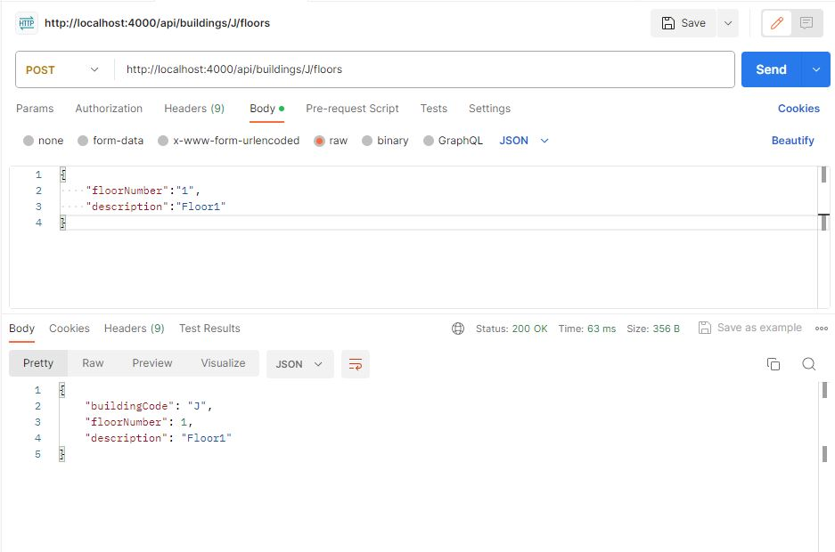
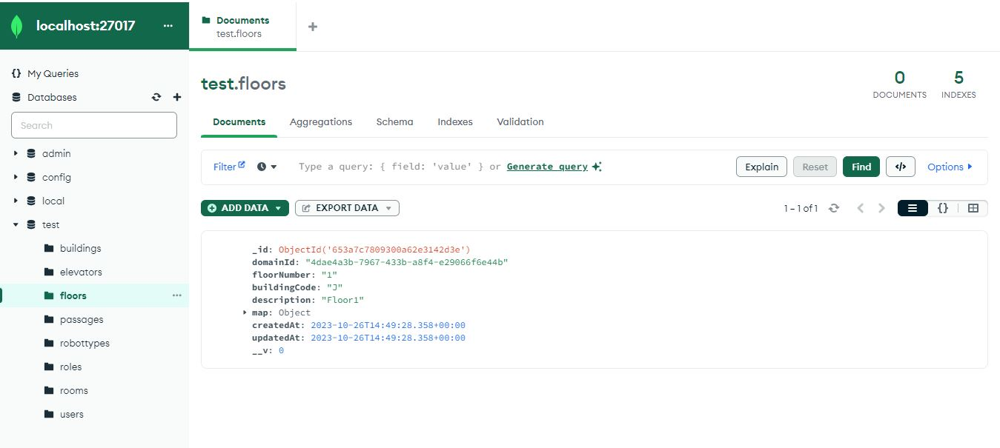

# US190

### 1. User Story Description

I intend to create a floor

### 2. Customer Specifications and Clarifications

1. From [GAVRIKOVA: ID190 floor code](https://moodle.isep.ipp.pt/mod/forum/discuss.php?d=25484)

> > Good evening, Does the floor code have any format or restrictions? Also, does it include any reference to the number of
the floor in the building (first, second, etc) or we should define the floor number separately?

> what exactly do you mean by "floor code"? a floor is characterized by its number (e.g., "-1", "2") and its building (e.g., "B", "C")
along with a short description (e.g., "Laboratories").
If by "code" you mean a way to uniquely identify a floor, then it is a combination of the building and the floor number,
but keep in mind that there is no such thing as floor "A1" from the business perspective.
The customers always mention "the first floor of building A"

2. From [Inês Alves: US id310/190/230 Criar sala de piso de edifício](https://moodle.isep.ipp.pt/mod/forum/discuss.php?d=25016))

> > Será possível esclarecer como funcionarão estas user stories? Com a 230 (Carregar mapa do piso) o nosso entendimento foi
que as células seriam carregadas já com a criação de salas e pisos, e assim sendo não faria sentido as outras
duas user stories, onde é pedido para criar um piso de um edifício e uma sala.
Não entendemos o que é pretendido  com as us's 190 e 310.

> o requisito 190 Criar piso permite definir um piso para um dos edificios criados anteriormente, por exemplo,
o piso 1 do edificio B com uma breve descrição (ex., "salas TP")

3. From [SOUSA: US190 - Criar Piso de Edifício](https://moodle.isep.ipp.pt/mod/forum/discuss.php?d=25248)

> > Boa tarde, caro cliente.
É esperado que seja imposto um limite aquando da criação de um piso? Ex: 0 <= andar piso <= 100, De forma a evitar valores irrealistas.
Relativamente à breve descrição, referida em: https://moodle.isep.ipp.pt/mod/forum/discuss.php?d=25016,
existirá alguma restrição quanto ao comprimento da mesma, como é o caso da descrição do edifício?

> bom dia,
não existem limites. podem existir pisos subteraneos, ex., piso -1.
a breve descrição é opcional e no máximo terá 250 caracteres

### 3. Diagrams

### Level 1

- [Logical View](../general-purpose/level1/logical-view.svg)
- [Process View](./level1/process-view.svg)

### Level 2

- [Logical View](../general-purpose/level2/logical-view.svg)
- [Process View](./level2/process-view.svg)

### Level 3

- [Logical View](../general-purpose/level3/logical-view.svg)
- [Process View](./level3/process-view.svg)
- [Implementation View](../general-purpose/level3/implementation-view.svg)
- [Class Diagram](./level3/class-diagram.svg)


### 4. HTTP

### 4.1 HTTP Requests

|   Method    |          HTTP request          |
|:-----------:|:------------------------------:|
| POST | /buildings/:id/floors |

### 4.2 HTTP Response

|  Status code  |       Description       |
|:-------------:|:-----------------------:|
|    **201**    |         Floor Created         |
|    **404**    |       Building not found |
|    **422**    |  Floor already exists |

### 4.3 Authorization

n/a

### 4.4 HTTP Request Body

```json
[
    {
        "floorNumber": "1",
        "description": "Floor 1"
    }
]
```

### 4.5 Simulation HTTP requests




## 5. Design Patterns

- Dependency inversion: Classes of one layer don't use specific implementations of a class from another layer (aside from domain); instead an interface defines a contract for how communications are made.

- Dependency injection: Since no explicit implementations are used, an injection mechanism takes care of deciding, at runtime, which implementation to use based on a configuration file.

- Single Responsibility (partially) - for each domain entity, there is a dedicated controller, service, repository (interface) definition that deals with/processes/handles operations related to that domain entity, and no other.
    + The reason it is a partial use lies in the fact that each controller/service could be broken down by use case rather than by entity

- DTO: DTO's are used to transfer information between the different layers

