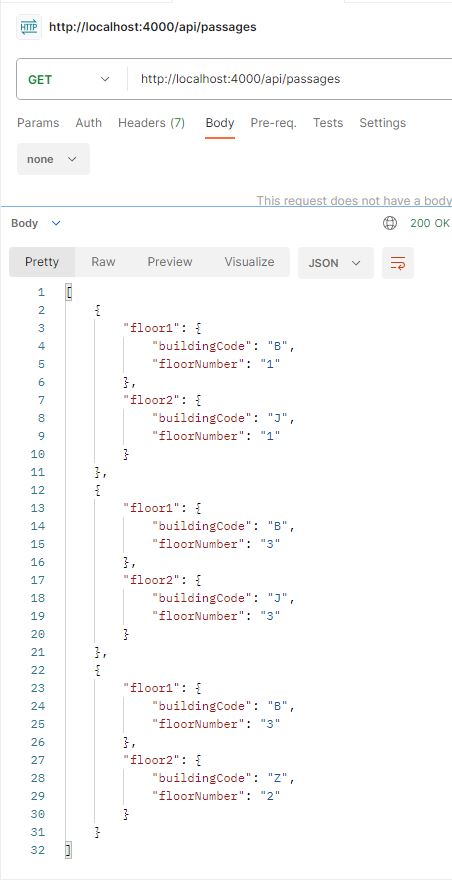
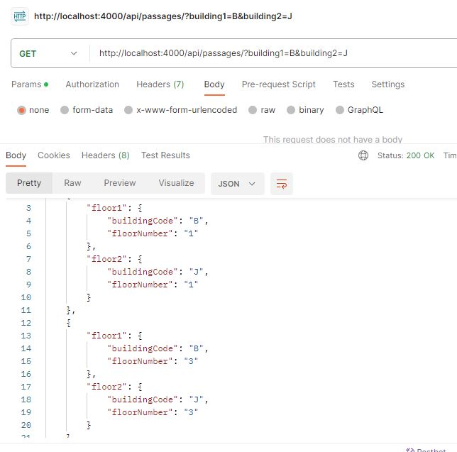
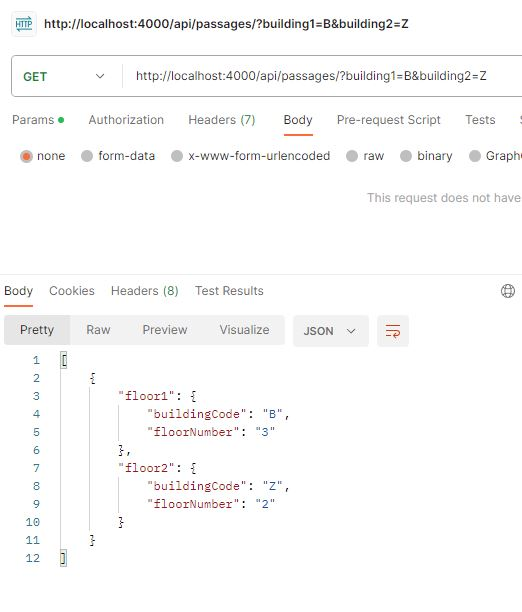

# US 260 - List passages between 2 buildings

### 1. User Story Description
Listar passagens entre 2 edifícios

### 2. Customer Specifications and Clarifications
1. From [ALVES: \[Requisitos\] Listar passagens entre 2 edifícios](https://moodle.isep.ipp.pt/mod/forum/discuss.php?d=25007#p31604)

> **Question** Caro cliente,
A US 260 (listar passagens entre 2 edifícios) deixou-me com uma dúvida: haverão múltiplas passagens entre 2 edifícios, isto é (por exemplo), haverá múltiplas passagens entre os edifícios A e B em pisos diferentes ou até no mesmo piso?
Caso a resposta seja "Sim", surgiram-me as seguintes opções para desenvolver esta US:
-esta listagem refere-se a uma lista de passagens entre (por exemplo) o edifício A e B;
-esta listagem refere-se a uma lista de passagens entre todos os edifícios;
-esta listagem necessita de uma questão ao utilizador para fazer uma das duas opções anteriormente referidas e, após, fazer a listagem.
Qual destas seria a esperada por si?
Os melhores cumprimentos,
Grupo 002.

> **Answer**
bom dia,
sim podem existir várias passagens entre edificios. Por exemplo, no edificio B do ISEP existe uma passagem no piso 2 para o edificio G, uma passagem no piso 3 para o edificio G e uma passagem no piso 3 para o edificio I
o objetivo deste requisito é permitir consultar quais as passagens existentes entre dois edificios. se nada for indicado devem ser devolvidas todas as passagens entre todos os edificios. se for indicado um par de edificos devem apenas ser devolvidas as passagens entre esses dois edifcios.
notem que uma vez que as passagens são bidirecionais, uma passagem entre o edificio B e o I, significa que se pode atravessar de B para I ou de I para B. o par de edificios utilizado para filtrar esta consulta não implica nenyum tipo de restrição no sentido da passagem.

### 3. Diagrams
### Level 1
- [Logical View](../general-purpose/level1/logical-view.svg)
- [Process View](./level1/process-view.svg)

### Level 2
- [Logical View](../general-purpose/level2/logical-view.svg)
- [Process View](./level2/process-view.svg)

### Level 3

- [Logical View](../general-purpose/level3/logical-view.svg)
- [Process View](./level3/process-view.svg)
- [Implementation View](../general-purpose/level3/implementation-view.svg)

- [Class Diagram](./class-diagram.svg)

### 4. HTTP

### 4.1 HTTP Requests
| Method    | URI        |
|:---------:|:----------:|
| **GET**   | /passages/ |

**Query params:**

- building1: code for building 1
- building2: code for building 2

### 4.2 HTTP Response
| Status code | Description                                     |
|:-----------:|:-----------------------------------------------:|
| 200         | Passages returned                               |
| 404         | Building not found                              |
| 422         | Invalid data (bad format/breaks business rules) |

### 4.3 Authorization

N/a.

### 4.4 HTTP Request Query

[HTTP REQUEST Query](./README/test.passagesbetween.txt)

### 4.5 Simulation HTTP requests

<!-- TODO: further improve -->

### 5. Design Patterns

- Dependency inversion: Classes of one layer don't use specific implementations of a class from another layer (aside from domain); instead an interface defines a contract for how communications are made.

- Dependency injection: Since no explicit implementations are used, an injection mechanism takes care of deciding, at runtime, which implementation to use based on a configuration file.

- Single Responsibility (partially) - for each domain entity, there is a dedicated controller, service, repository (interface) definition that deals with/processes/handles operations related to that domain entity, and no other.
    + The reason it is a partial use lies in the fact that each controller/service could be broken down by use case rather than by entity

### 6.Test

<!-- TODO -->

<!-- vim: set spelllang+=pt: -->
