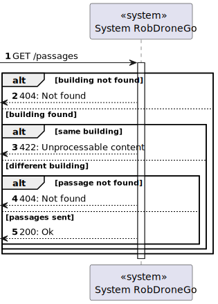
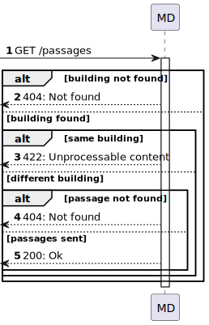
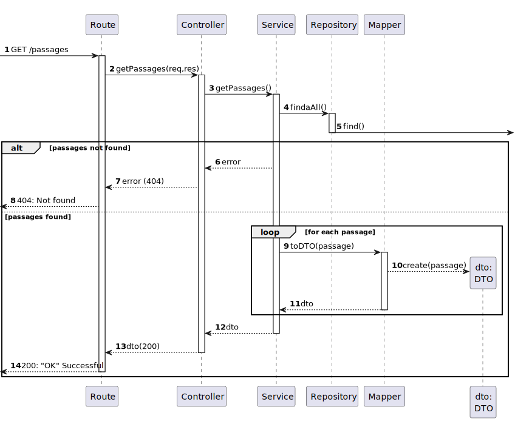
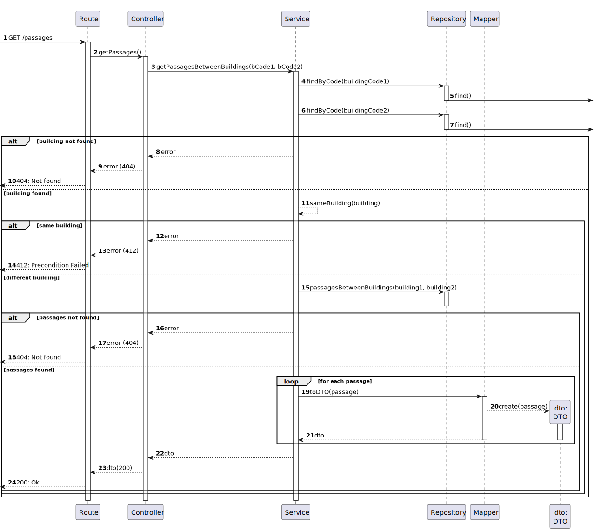

# US 260 - List passages between 2 buildings

### 1. User Story Description

As an administrator, I intend passages between 2 buildings

### 2. Customer Specifications and Clarifications

**From the specifications document:**

**From the client clarifications:**

> **Question**Caro cliente,
A US 260 (listar passagens entre 2 edifícios) deixou-me com uma dúvida: haverão múltiplas passagens entre 2 edifícios, isto é (por exemplo), haverá múltiplas passagens entre os edifícios A e B em pisos diferentes ou até no mesmo piso?
Caso a resposta seja "Sim", surgiram-me as seguintes opções para desenvolver esta US:
-esta listagem refere-se a uma lista de passagens entre (por exemplo) o edifício A e B;
-esta listagem refere-se a uma lista de passagens entre todos os edifícios;
-esta listagem necessita de uma questão ao utilizador para fazer uma das duas opções anteriormente referidas e, após, fazer a listagem.
Qual destas seria a esperada por si?
Os melhores cumprimentos,
Grupo 002.

> **Answer**
bom dia,
sim podem existir várias passagens entre edificios. Por exemplo, no edificio B do ISEP existe uma passagem no piso 2 para o edificio G, uma passagem no piso 3 para o edificio G e uma passagem no piso 3 para o edificio I
o objetivo deste requisito é permitir consultar quais as passagens existentes entre dois edificios. se nada for indicado devem ser devolvidas todas as passagens entre todos os edificios. se for indicado um par de edificos devem apenas ser devolvidas as passagens entre esses dois edifcios.
notem que uma vez que as passagens são bidirecionais, uma passagem entre o edificio B e o I, significa que se pode atravessar de B para I ou de I para B. o par de edificios utilizado para filtrar esta consulta não implica nenyum tipo de restrição no sentido da passagem.

### 3. Diagrams

### 4. HTTP

### 4.1 HTTP Requests

|   Method    |                HTTP request                |                         Description                          |
|:-----------:|:------------------------------------------:|:------------------------------------------------------------:|
| getPassages | **GET** /passages/?building1=B&building2=Z | Passage Route calls method getPassages in passagesController |
| getPassages | **GET** /passages/?building1=B&building2=J |                                                              |
| getPassages |             **GET** /passages              |                                                              |
### 4.2 HTTP Response
| Status code |     Description     |
|:-----------:|:-------------------:|
|   **200**   |         OK          |
|   **412**   | Precondition Failed |

### 4.3 Authorization

No authorization required

### 4.4 HTTP Request Query

[HTTP REQUEST Query](./README/test.passagesbetween.txt)

### 4.5 Simulation HTTP requests

