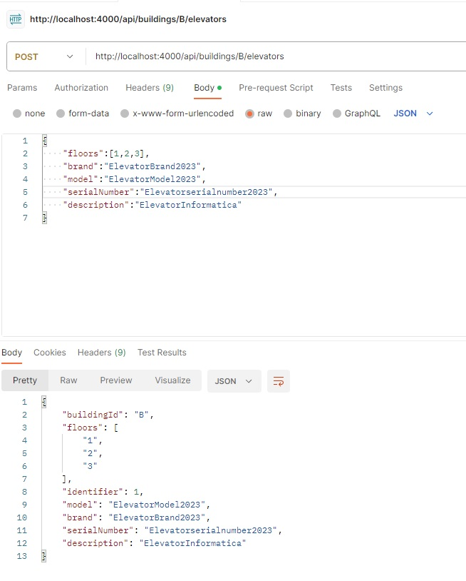
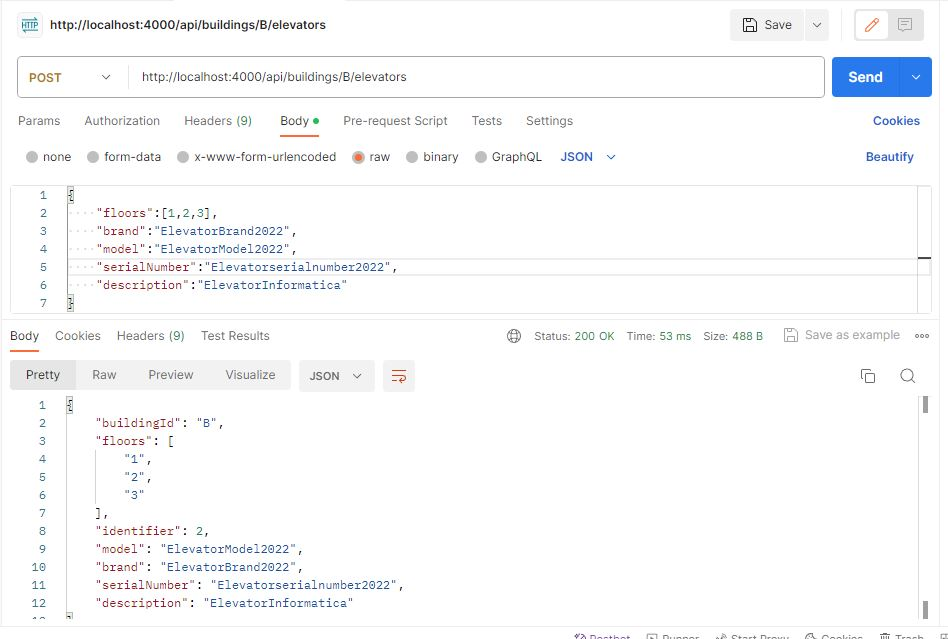
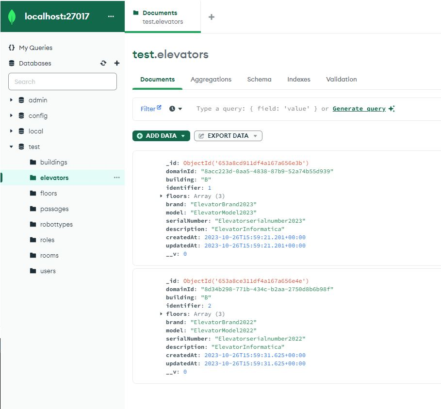

# US 270 - Create Elevator

### 1. User Story Description
Criar elevador em edifício

### 2. Customer Specifications and Clarifications
1. From [TEIXEIRA: US270](https://moodle.isep.ipp.pt/mod/forum/discuss.php?d=25267#p31994)

> **Question:** Olá, há alguma restrição para o ID do elevador?

> **Answer:** bom dia, não sei a que se refere quando refere "ID"
assumindo que a sua pergunta é sobre se há necessidade de identificar os elevadores, cada elevador terá um número identificativo único no edificio. De momento assume-se que existe apenas um elevador em cada edificio.

> **Question:** esse número identificativo tem alguma especificação? era isso que queria perguntar.

> **Answer:** bom dia trata-se de um número inteiro

2. From [MOREIRA: US270](https://moodle.isep.ipp.pt/mod/forum/discuss.php?d=25336#p32096)

> **Question:** Boa tarde,
Após análise do enunciado deparei-me com a coincidência: todos os edificios que têm elevador, este último serve todos os pisos desse edificio. Pode existir algum edifício em que o elevador não sirva todos os pisos?
Cumprimentos,

> **Answer:** bom dia, sim, é possivel tal situação

3. From [RENTE: US270 - Criar Elevador](https://moodle.isep.ipp.pt/mod/forum/discuss.php?d=25353#p32114)

> **Question:**  Bom dia caro cliente, Relativamente à funcionalidade de criar elevador, no seguimento da sua resposta em (https://moodle.isep.ipp.pt/mod/forum/discuss.php?d=25298#p32051), gostaríamos que clarificasse quais das propriedades que indicou serem alfanuméricas podem conter espaços; por exemplo, nós acharíamos que seria sensato a descrição poder conter espaços.
Cumprimentos,
Grupo 19
>
> **Question:** Adicionalmente, gostaria de saber se o identificador numérico que referiu deve ser fornecido ao sistema ou gerado automaticamente pelo mesmo, dado que este deve ser único dentro de cada edifício.

> **Answer:** bom dia,  todos os atributos alfanumercos podme conter espaços à exceção do número de série
o número indeitifcativo do elevador deve ser gerado sequencialmente pelo sistema tendo em conta o edifico, por exemplo, existirá o elevador 1 do edificio B e o elevador 1 do edificio A


### 3. Diagrams
### Level 1
- [Logical View](../general-purpose/level1/logical-view.svg)
- [Process View](./level1/process-view.svg)

### Level 2
- [Logical View](../general-purpose/level2/logical-view.svg)
- [Process View](./level2/process-view.svg)

### Level 3

- [Logical View](../general-purpose/level3/logical-view.svg)
- [Process View](./level3/process-view.svg)
- [Implementation View](../general-purpose/level3/implementation-view.svg)

- [Class Diagram](./class-diagram.svg)

### 4. HTTP

### 4.1 HTTP Requests

| Method    | URI                         |
|:---------:|:---------------------------:|
| **POST**  | /buildings/{:id}/elevators  |

### 4.2 HTTP Response
| Status code | Description                                     |
|:-----------:|:-----------------------------------------------:|
|   **201**   | Elevator created                                |
|   **404**   | Building/Floors not found                       |
|   **422**   | Invalid data (bad format/breaks business rules) |

### 4.3 Authorization

N/a.

### 4.4 HTTP Request Body

```json
{
    "floors": [1, 2],
    "brand": "Schindler",
    "model": "3310 XL",
    "serialNumber": "2134444",
    "description": "vvvvvv",
}
```

### 4.5 Simulation HTTP requests




<!-- TODO: further improve? -->

### 5. Design Patterns

- Dependency inversion: Classes of one layer don't use specific implementations of a class from another layer (aside from domain); instead an interface defines a contract for how communications are made.

- Dependency injection: Since no explicit implementations are used, an injection mechanism takes care of deciding, at runtime, which implementation to use based on a configuration file.

- Single Responsibility (partially) - for each domain entity, there is a dedicated controller, service, repository (interface) definition that deals with/processes/handles operations related to that domain entity, and no other.
    + The reason it is a partial use lies in the fact that each controller/service could be broken down by use case rather than by entity

### 6.Test

<!-- TODO -->

<!-- vim: set spelllang+=pt -->
