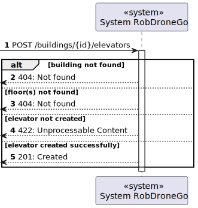
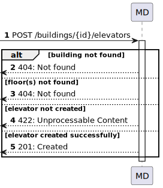

# US 270 - Create Elevator - Level 3

### 1. User Story Description

As an administrator, I intend to create an elevator inside the building.

### 2. Customer Specifications and Clarifications

**From the specifications document:**

**From the client clarifications:**

> **Question:**

> **Answer:**

### 3. Diagrams

### 4. HTTP

### 4.1 HTTP Requests

|     Method     |    HTTP request     |                           Description                            |
|:--------------:|:-------------------:|:----------------------------------------------------------------:|
| createElevator | **POST** /buildings/:id/elevators | Building Route calls method createElevator in elevatorController |

### 4.2 HTTP Response
|  Status code  |       Description       |
|:-------------:|:-----------------------:|
|    **201**    |         Created         |
|    **422**    |  Unprocessable Content  |

### 4.3 Authorization

No authorization required

### 4.4 HTTP Request Body

[HTTP REQUEST BODY](./README/test.elevators.txt)

### 4.5 Simulation HTTP requests

