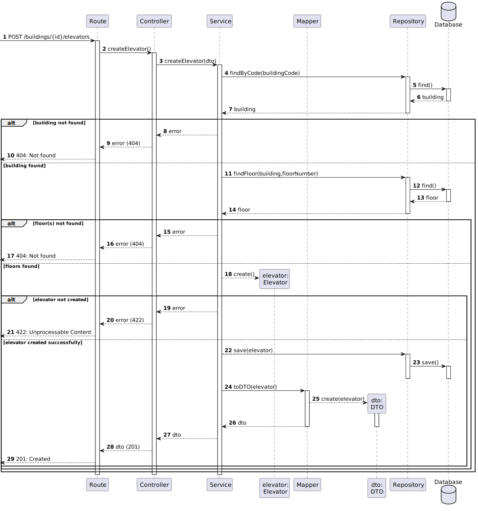

# US 270 - Create Elevator

### 1. User Story Description

As an administrator, I intend to create an elevator inside the building.

### 2. Customer Specifications and Clarifications

**From the specifications document:**

**From the client clarifications:**

> **Question:** Olá, há alguma restrição para o ID do elevador?

> **Answer:** bom dia, não sei a que se refere quando refere "ID"
assumindo que a sua pergunta é sobre se há necessidade de identificar os elevadores, cada elevador terá um número identificativo único no edificio. De momento assume-se que existe apenas um elevador em cada edificio.

> **Question:** esse número identificativo tem alguma especificação? era isso que queria perguntar.

> **Answer:** bom dia trata-se de um número inteiro

> **Question:** Boa tarde,
Após análise do enunciado deparei-me com a coincidência: todos os edificios que têm elevador, este último serve todos os pisos desse edificio. Pode existir algum edifício em que o elevador não sirva todos os pisos?
Cumprimentos,

> **Answer:** bom dia, sim, é possivel tal situação

> **Question:**  Bom dia caro cliente, Relativamente à funcionalidade de criar elevador, no seguimento da sua resposta em (https://moodle.isep.ipp.pt/mod/forum/discuss.php?d=25298#p32051), gostaríamos que clarificasse quais das propriedades que indicou serem alfanuméricas podem conter espaços; por exemplo, nós acharíamos que seria sensato a descrição poder conter espaços.
Cumprimentos,
Grupo 19
>
> **Question:** Adicionalmente, gostaria de saber se o identificador numérico que referiu deve ser fornecido ao sistema ou gerado automaticamente pelo mesmo, dado que este deve ser único dentro de cada edifício.

> **Answer:** bom dia,  todos os atributos alfanumercos podme conter espaços à exceção do número de série
o número indeitifcativo do elevador deve ser gerado sequencialmente pelo sistema tendo em conta o edifico, por exemplo, existirá o elevador 1 do edificio B e o elevador 1 do edificio A

### 3. Diagrams

### 4. HTTP

### 4.1 HTTP Requests

|     Method     |    HTTP request     |                           Description                            |
|:--------------:|:-------------------:|:----------------------------------------------------------------:|
| createElevator | **POST** /buildings/:id/elevators | Building Route calls method createElevator in elevatorController |

### 4.2 HTTP Response
| Status code |      Description      |
|:-----------:|:---------------------:|
|   **201**   |        Created        |
|   **412**   |  Precondition Failed  |
|   **422**   | Unprocessable Content |

### 4.3 Authorization

No authorization required

### 4.4 HTTP Request Body

[HTTP REQUEST BODY](./README/test.elevators.txt)

### 4.5 Simulation HTTP requests

