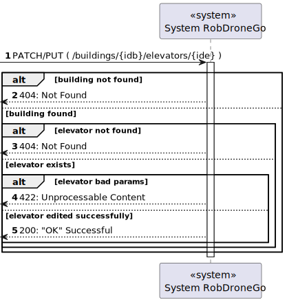
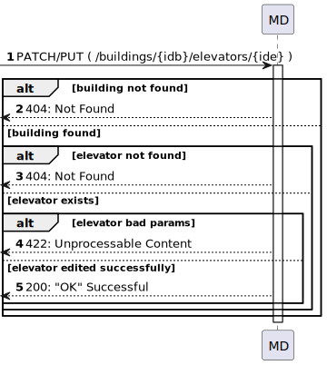
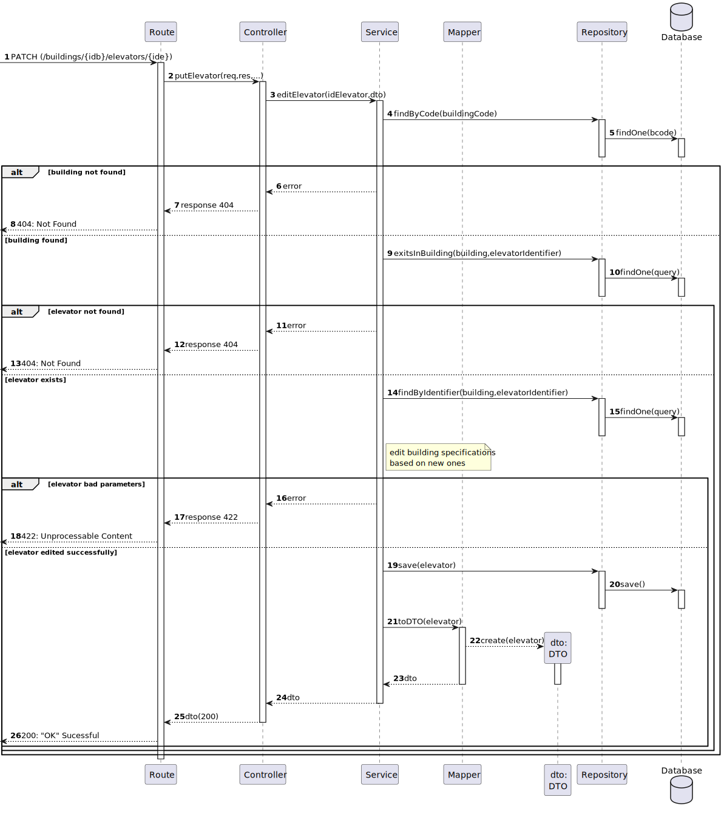
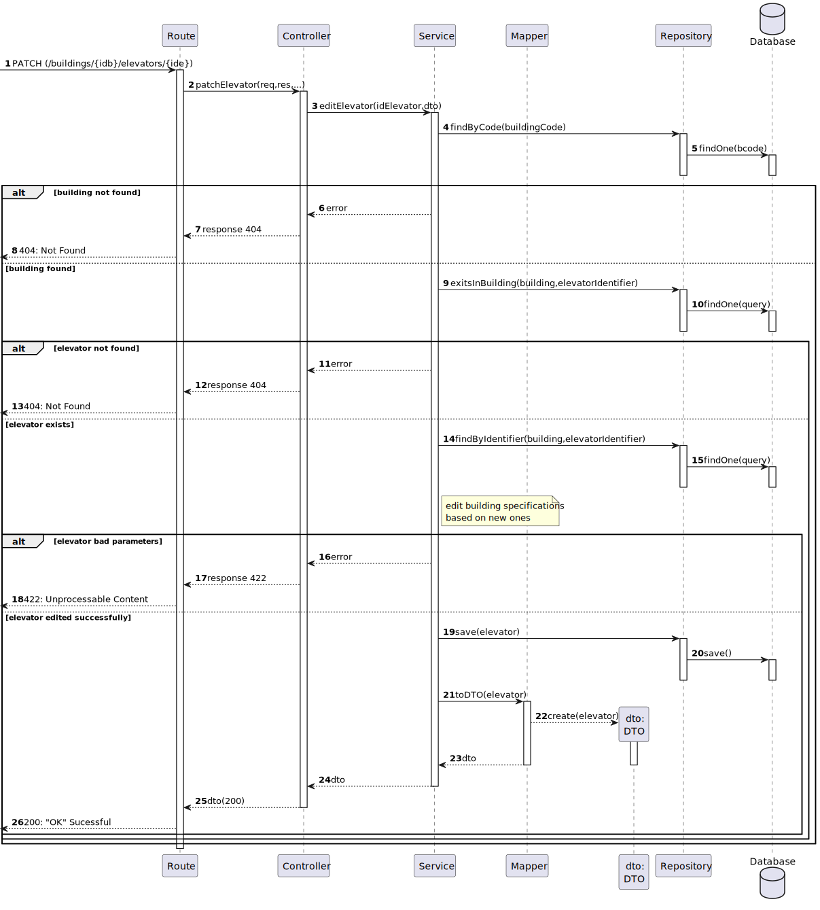
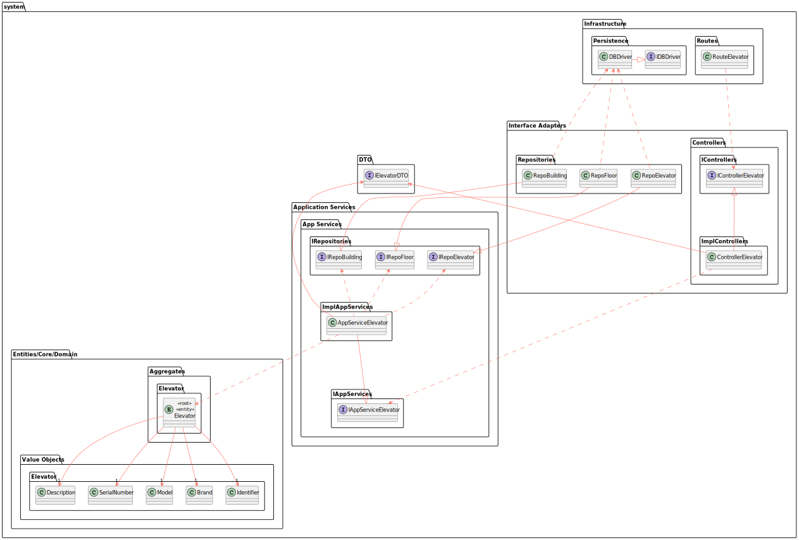

# US 280 - Edit elevator in a building.

### 1. User Story Description

As an administrator, I intend to edit an elevator in a building.

### 2. Customer Specifications and Clarifications

**From the specifications document:**

**From the client clarifications:**

> **Question:** Caro cliente,
Dentro de uma discussão do fórum, encontrei esta informação quanto ao requisito 280:
"requisito 280 - editar elevador - todas as informações à exceção do edificio a que o piso se refere"
Como tal, gostaria de saber que atributos deveria ter o elevador, para além de uma lista de pisos aos quais consegue aceder dentro do seu edifício. Algumas das ideias que me surgiram foram o piso em que estava localizado naquele momento, número de série, fabricante ou descrição.
Obrigado desde já,
Grupo 002.

> **Answer:**
bom dia,
edificio (obrigatório)
número identificativo (obrigatório, único no edificio)
lista de pisos do edificio servidos pelo elevador (obrigatório)
marca (opcional, alfanumerico, 50 caracteres)
modelo (opcional, mas obrigatório se marca for introduzido, alfanumerico, 50 caracteres)
número de série do fabricante (opcional, alfanumerico, 50 caracteres)
breve descrição (opcional, alfanumerico, 250 caracteres)

### 3. Diagrams

### 4. HTTP

### 4.1 HTTP Requests

|    Method     |                HTTP request                |                          Description                           |
|:-------------:|:------------------------------------------:|:--------------------------------------------------------------:|
|  putElevator  |  **PUT** /buildings/{idb}/elevators/{ide}  | Building Route calls method getElevators in elevatorController |
| patchElevator | **PATCH** /buildings/{idb}/elevators/{ide} | Building Route calls method getElevators in elevatorController |

### 4.2 HTTP Response
| Status code |      Description      |
|:-----------:|:---------------------:|
|   **200**   |          OK           |
|   **412**   |  Precondition Failed  |
|   **422**   | Unprocessable Content |

### 4.3 Authorization

No authorization required

### 4.4 HTTP Request Body

[HTTP REQUEST BODY](./README/test.elevators.txt)

### 4.5 Simulation HTTP requests

## 4.5.1 PATCH

## 4.5.2 PUT

