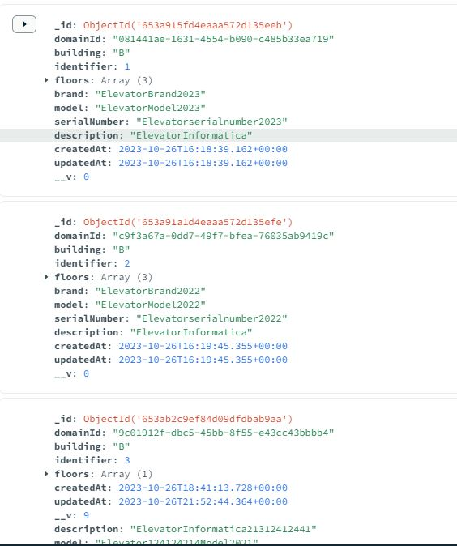

# US 290 - List elevators inside building

### 1. User Story Description

I intend to list all elevators inside a building.

### 2. Customer Specifications and Clarifications

**From the specifications document:**

**From the client clarifications:**

> **Question:** Olá,
o enunciado diz:
"Assume-se apenas um elevador por edifício"
Tendo em conta que só há um elevador por edificio, pretende-se saber qual é o elevador de cada edificio? Ou é suposto haver mais do que um elevador num edificio?

> **Answer:** bom dia,
de momento apenas necessitam suportar um elevador por edificio

> **Question:** Boa tarde,
Já foi aqui, aqui e aqui referido que só é necessário considerar 1 elevador por edifício.
Nesta US pretende-se devolver ("listar") apenas 1 elevador.
Que informacoes pretende, então, ver sobre esse elevador?
Com os melhores cumprimentos,
g079

> **Answer:** bom dia,
pretende-se listar todas as informações do elevador.
notem que quando é dito que podem assumir que existe apenas um elevador é uma maneira de simplificar o problema para esta fase de prototipo, principalmente reduzindo a complexidade dos mapas e do calculo de percursos, mas nada vos impede de suportar vários elevadores no sistema se assim o entenderem

### 3. Diagrams

### 4. HTTP

### 4.1 HTTP Requests

|    Method    |           HTTP request           |                          Description                           |
|:------------:|:--------------------------------:|:--------------------------------------------------------------:|
| getElevators | **GET** /buildings/:id/elevators | Building Route calls method getElevators in elevatorController |

### 4.2 HTTP Response
| Status code |  Description   |
|:-----------:|:--------------:|
|   **200**   |       OK       |
|   **404**   |   Not Found    |

### 4.3 Authorization

No authorization required

### 4.4 HTTP Request Body

For this user story , request body doesn't exist

### 4.5 Simulation HTTP requests

### 5. Design Patterns

- Dependency inversion: Classes of one layer don't use specific implementations of a class from another layer (aside from domain); instead an interface defines a contract for how communications are made.

- Dependency injection: Since no explicit implementations are used, an injection mechanism takes care of deciding, at runtime, which implementation to use based on a configuration file.

- Single Responsibility (partially) - for each domain entity, there is a dedicated controller, service, repository (interface) definition that deals with/processes/handles operations related to that domain entity, and no other.
    + The reason it is a partial use lies in the fact that each controller/service could be broken down by use case rather than by entity
