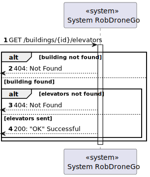
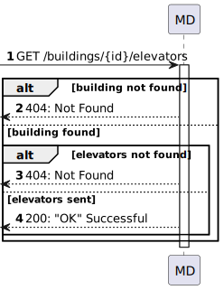
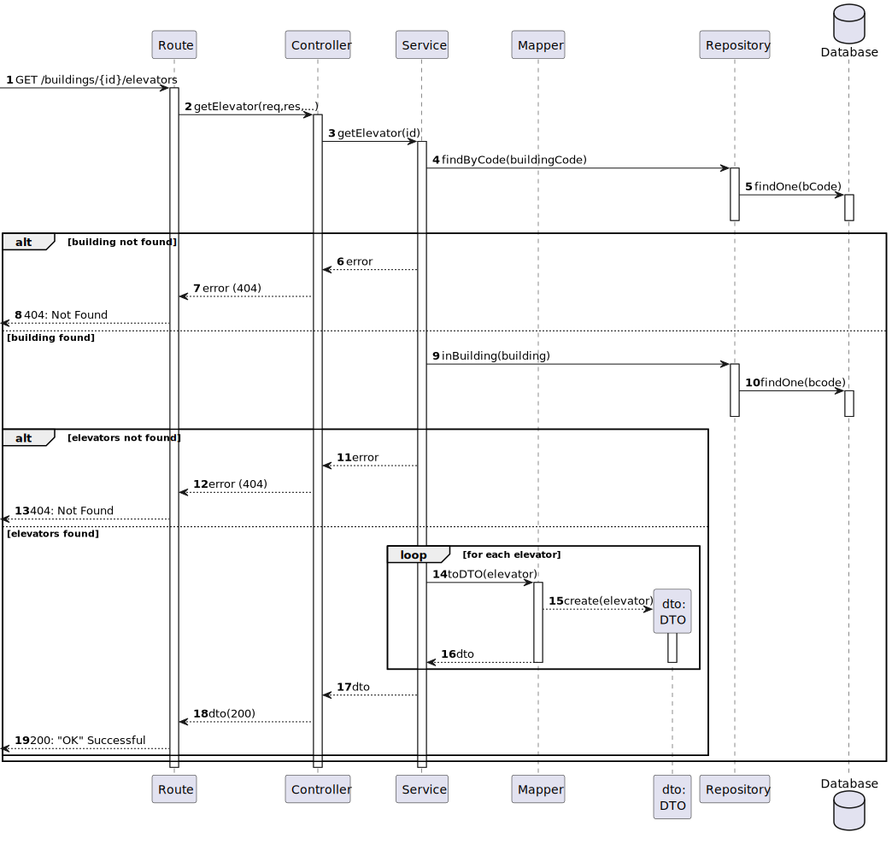
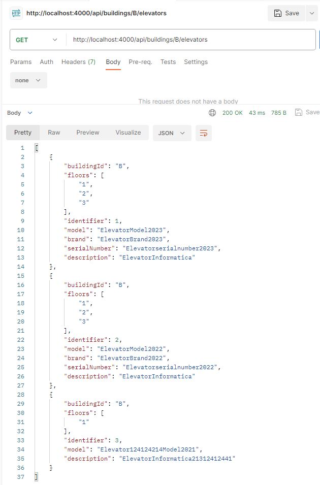

# US 290 - List elevators inside building - Level 3

### 1. User Story Description

As an administrator, I intend to list all elevators inside a building.

### 2. Customer Specifications and Clarifications

**From the specifications document:**

**From the client clarifications:**

> **Question:**

> **Answer:**

### 3. Diagrams

### 4. HTTP

### 4.1 HTTP Requests

|    Method    |    HTTP request     |                          Description                           |
|:------------:|:-------------------:|:--------------------------------------------------------------:|
| getElevators | **POST** /buildings/:id/elevators | Building Route calls method getElevators in elevatorController |

### 4.2 HTTP Response
| Status code |     Description     |
|:-----------:|:-------------------:|
|   **200**   |         OK          |
|   **412**   | Precondition Failed |

### 4.3 Authorization

No authorization required

### 4.4 HTTP Request Body

For this user story , request body doesn't exist

### 4.5 Simulation HTTP requests

