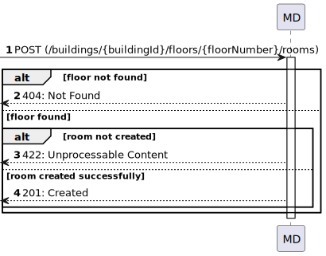
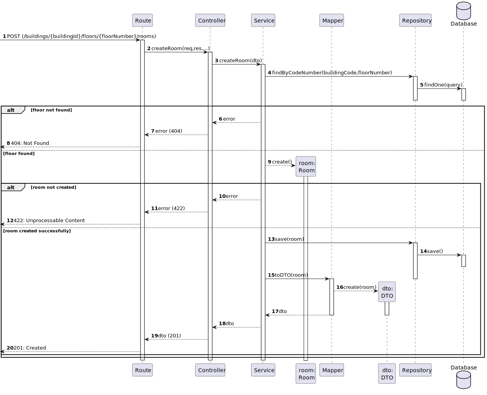
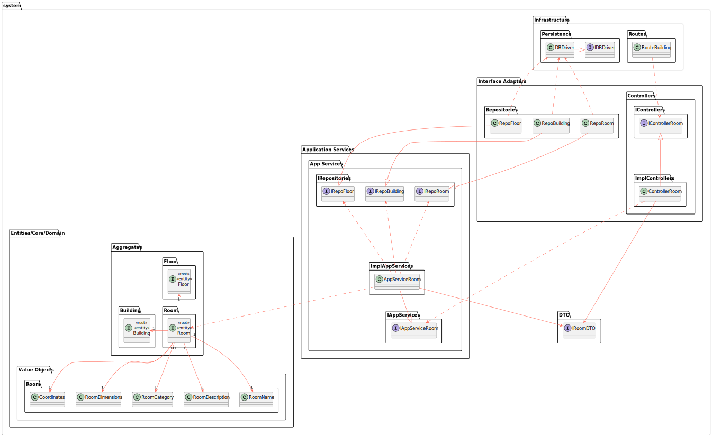
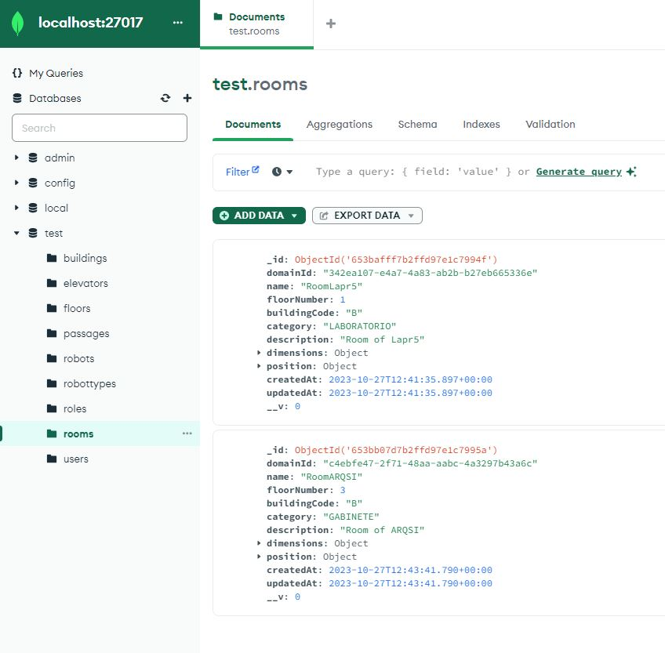

# US 310 - Create room in floor in building

### 1. User Story Description

As an administrator, I intend to create a room in a floor in a building

### 2. Customer Specifications and Clarifications

**From the specifications document:**

**From the client clarifications:**

> **Question:** Bom dia,
Relativamente à informação fornecida pelo cliente referente à US310, ele diz "o requisito 310
Criar sala permite definir um sala num dado piso de um edifício, exemplo sala "B310" no 3º piso do edifício B",
este nome da sala é suposto ser criado automaticamente uma vez que a sala saberá o piso em que se encontra e o piso sabe o edifício em que está,
sendo apenas preciso verificar o número de salas que esse piso já  tem para saber o número da nova sala ou somos nós que introduzimos o nome da sala e colocamos onde queremos conforme o nome que lhe demos?

> **Answer:** bom dia esse nome é introduzido pelo utilizador. não existe semantica prédefinida conhecido do sistema

> **Question:** Caro cliente, deveria o nome da sala ser único? Cumprimentos, Grupo 002.

> **Answer:** bom dia, sim

> **Question:** Bom dia caro cliente, Em relação aos atributos que definem uma sala, quais são os limites desejados para o seu nome e descrição.
Ainda, existem algum tamanho mínimo para criar uma sala?
Cumprimentos.

> **Answer:** bom dia, nome - max 50 caracteres
descrição - max 250 caracteres
tamanho minimo da sala - 1 célula

> **Question:** Caro cliente, Será possível esclarecer como funcionarão estas user stories? Com a 230 (Carregar mapa do piso) o nosso entendimento foi que as células seriam carregadas já com a criação de salas e pisos, e assim sendo não faria sentido as outras duas user stories, onde é pedido para criar um piso de um edifício e uma sala. Não entendemos o que é pretendido  com as us's 190 e 310.
Atentamente,
Grupo 63

> **Answer:** boa tarde, .... o requisito 310 Criar sala permite definir um sala num dado piso de um edificio, exemplo sala "B310" no 3º piso do edificio B, com uma categorização dessa sala (Gabinete, Anfiteatro, Laboratório, Outro) e uma breve descrição, ex., "Laboratório de Engenharia de Qualidade"...
as categorias são de uma lista especifica. neste momento não é necessário existir manutenção dessa lista devendo apenas existir os 4 valores indicados, no entanto será interessante deixarem o sistema "aberto" para essa possibilidade no futuro

### 3. Diagrams

### 4. HTTP

### 4.1 HTTP Requests

|   Method   |                       HTTP request                        |                       Description                        |
|:----------:|:---------------------------------------------------------:|:--------------------------------------------------------:|
| createRoom | **POST** /buildings/:buildingId/floors/:floorNumber/rooms | Building Route calls method createRoom in roomController |

### 4.2 HTTP Response
| Status code |      Description      |
|:-----------:|:---------------------:|
|   **201**   |        Created        |
|   **404**   |       Not Found       |
|   **422**   | Unprocessable Content |

### 4.3 Authorization

No authorization required

### 4.4 HTTP Request Body

[HTTP REQUEST BODY](./README/test.rooms.txt)

### 4.5 Simulation HTTP requests

## 5. Design Patterns

Dependency inversion: Classes of one layer don't use specific implementations of a class from another layer (aside from domain); instead an interface defines a contract for how communications are made.

Dependency injection: Since no explicit implementations are used, an injection mechanism takes care of deciding, at runtime, which implementation to use based on a configuration file

Single Responsibility (partially) - for each domain entity, there is a dedicated controller, service, repository (interface) definition that deals with/processes/handles operations related to that domain entity, and no other.

DTO: DTO's are used to transfer information between the different layers

Repository Pattern: The Repository pattern is used to abstract and encapsulate data access and database operations. It provides a consistent API for accessing data, which can be implemented differently in different layers.

