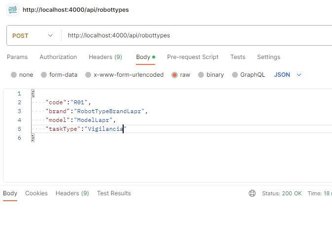
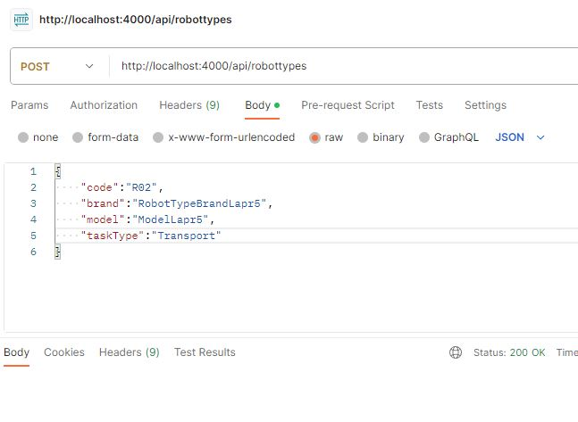
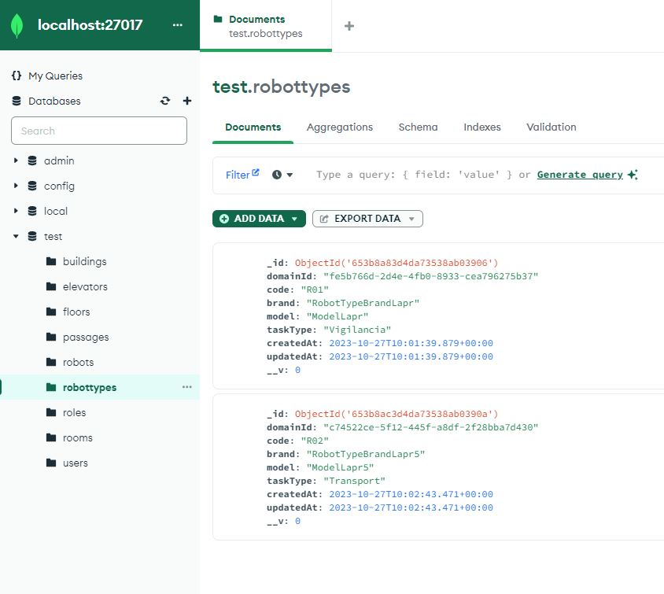

# US 350 - Create robottype

### 1. User Story Description

As a fleet manager, I intend to add a new type of robot, specifying its designation and the types of tasks it can perform from the predefined list of tasks

### 2. Customer Specifications and Clarifications

> **Question:** Bom dia estimando cliente,
A minha dúvida é em relação às tarefas e às suas definições.
Existem diferentes tipos de tarefas, por isso, cada uma terá os seus atributos. No entanto, que atributos definem uma tarefa em geral? Apenas a sua designação?
Em relação às tarefas existentes (vigilância de um piso e transporte de um objeto) existem algum requerimento especial? Para além da especificação do piso na vigilância e especificação do objeto e local de recolha e entrega no caso do transporte.
Obrigado em avanço.

> **Answer:** Boa tarde,
de momento todos os robots da frota apenas suportam estes dois tipos de tarefas. a existirem novos tipos de tarefas será necessáiro desenvolvimento especifico para tal. Em consequência não existem "tarefas em geral"
As tarefas de vigilância caracterizam-se por indicar qual o edificio e piso(s) que se pretende vigiar bem como o número de contacto em caso de incidente. tipicamente o segurança irá requisitar que um robot "dê uma volta pelos pisos X, Y e Z do edificio N". Caso o robot detete alguma situação anómala, o robot irá enviar um SMS para o contacto indicado (*)
As tarefas de "piclup & delivery" caracterizam-se por indicar qual a sala que se pretende de pickup e qual a sala de delivery, bem como um nome e um contacto para pickup e outro para delivery. deve também ser indicado um código de confirmação que a pessoa que receberá deverá introduzir no painel do robot. adicionalmente deve ser indicada uma descrição da entrega, ex., "Marcadores de cor vermelha (1x) e azul (2x)"
(*) fora do âmbito do protótipo

> **Question:** Boa tarde,
Poderia explicar as diferenças entre estas duas user stories, US350 e US360?

> **Answer:** boa tarde,
o requisito 360 permite definir que tipos de robots existem. por exemplo "Tipo A: Robot marca X modelo Y com capacidade de executar tarefas de vigilância" e "Tipo B: Robot marca W modelo Z com capacidade de executar tarefas de vigilância e pickeup&delivery"
o requisito 370 permite indicar que robots existem e de que tipo cada um é, por exemplo "Robot 'ABC32' do tipo A", "Robot 'Brian2' do tipo A" e "Robot 'Stew' do tipo B"

> **Question:** Olá, pode, por favor, explicar um pouco melhor?
A US 350 (Como gestor de frota pretendo adicionar um novo tipo de robot indicando a sua designação e que tipos de tarefas pode executar da lista prédefinida de tarefas) - adicionar um tipo é indicar qual é a marca, o modelo e as tarefas que pode desempenhar um robot?
A US 360 (Como gestor de frota pretendo adicionar um novo robot à frota indicando o seu tipo, designação, etc.) é associar as caracteristicas de um tipo a um robot?
Pode, por favor, clarificar as diferenças entre estas duas US? Obrigada

> **Answer:** bom dia,
no requisito 350 definimos tipos de robots e no requisito 360 definimos robots desses tipos.
se ajudar, fica aqui uma analogia.
*  definir tipos de viaturas:
    tipo 1: renault clio 5 portas gasolina
    tipo 2: renault megane 5 portas diesel
* definir viaturas:
    viatura com matricula AA-00-01 do tipo 1
    viatura com matricula BB-10-CC do tipo 2

> **Question:** Caro Cliente,
Em relação aos atributos do tipo de robot existe alguma condição no modelo do tipo de  robot, por exemplo: podemos ter  um robot da marca A e modelo A1 e outro marca B e modelo A1?
Cumprimentos,
Grupo 068

> **Answer:** boa tarde, marca e modelo são dois atributos de texto livre. o sistema não impoe restrições

> **Question:** Bom dia,
Relativamente à US350 foi referido numa resposta anterior "o requisito 350 permite definir que tipos de robots existem. por exemplo "Tipo A: Robot marca X modelo Y com capacidade de executar tarefas de vigilância"
Pretende alguma regra de negócio para o limite de caracteres para o tipo, marca e modelo?
Cumprimentos

### 3. Diagrams

### Level 1

- [Logical View](../general-purpose/level1/logical-view.svg)
- [Process View](./level1/process-view.svg)

### Level 2
- [Logical View](../general-purpose/level2/logical-view.svg)
- [Process View](./level2/process-view.svg)

### Level 3
- [Logical View](../general-purpose/level3/logical-view.svg)
- [Process View](./level3/process-view.svg)
- [Implementation View](../general-purpose/level3/implementation-view.svg)
- [Class Diagram](./level3/class-diagram.svg)

### 4. HTTP

### 4.1 HTTP Requests

|   Method   |                       HTTP request                        |
|:----------:|:---------------------------------------------------------:|
| POST |  /robottypes |

### 4.2 HTTP Response
| Status code |      Description      |
|:-----------:|:---------------------:|
|   **201**   |        Created        |
|   **412**   |  Precondition Failed  |
|   **422**   | Unprocessable Content |

### 4.3 Authorization

Authorization required : Fleet Manager

### 4.4 HTTP Request Body

[HTTP REQUEST BODY](./README/test.robottypes.txt)

### 4.5 Simulation HTTP requests

### 5. Design Patterns
- Dependency inversion: Classes of one layer don't use specific implementations of a class from another layer (aside from domain); instead an interface defines a contract for how communications are made.

- Dependency injection: Since no explicit implementations are used, an injection mechanism takes care of deciding, at runtime, which implementation to use based on a configuration file.

- Single Responsibility (partially) - for each domain entity, there is a dedicated controller, service, repository (interface) definition that deals with/processes/handles operations related to that domain entity, and no other.
    + The reason it is a partial use lies in the fact that each controller/service could be broken down by use case rather than by entity

- DTO: DTO's are used to transfer information between the different layers

- Repository Pattern: The Repository pattern is used to abstract and encapsulate data access and database operations. It provides a consistent API for accessing data, which can be implemented differently in different layers.

