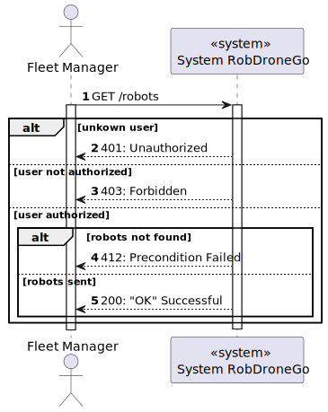
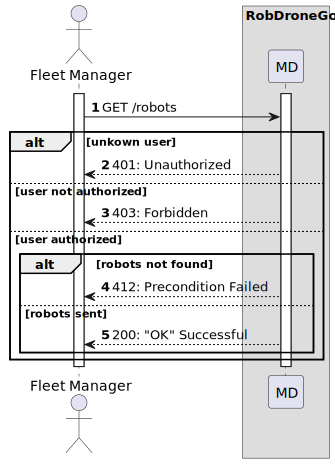
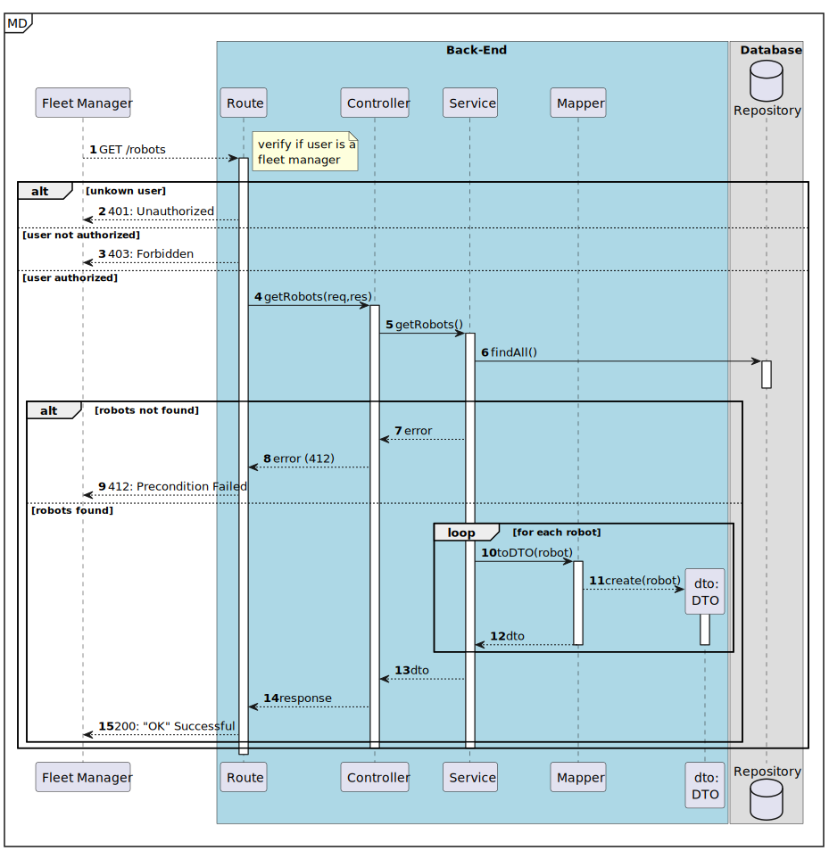
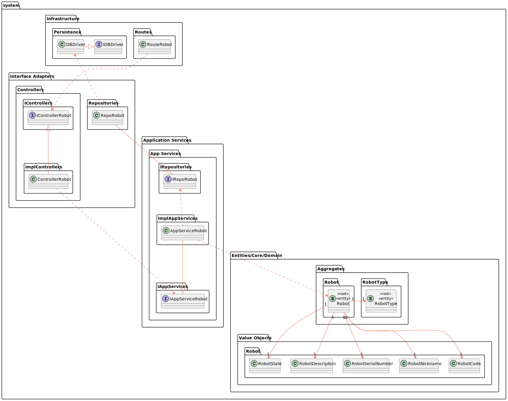
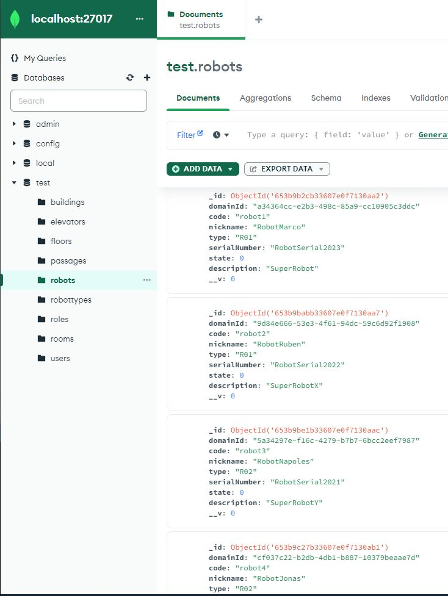
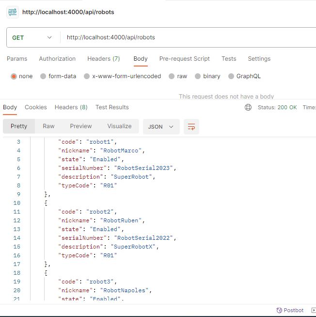

# US 380 - List robots

### 1. User Story Description

As a fleet manager, I intend to list all the fleet's robots

### 2. Customer Specifications and Clarifications

**From the specifications document:**

**From the client clarifications:**

No questions done to the client about this user story

### 3. Diagrams

### 4. HTTP

### 4.1 HTTP Requests

|  Method   |  HTTP request   |                      Description                      |
|:---------:|:---------------:|:-----------------------------------------------------:|
| getRobots | **GET** /robots | Robot Route calls method getRobots in robotController |

### 4.2 HTTP Response
| Status code | Description  |
|:-----------:|:------------:|
|   **200**   |      OK      |
|   **401**   | Unauthorized |
|   **403**   |  Forbidden   |
|   **404**   |  Not found   |

### 4.3 Authorization

Authorization required : Fleet Manager

### 4.4 HTTP Request Body

For this user story , request body doesn't exist

### 4.5 Simulation HTTP requests

### 5. Design Patterns

- Dependency inversion: Classes of one layer don't use specific implementations of a class from another layer (aside from domain); instead an interface defines a contract for how communications are made.

- Dependency injection: Since no explicit implementations are used, an injection mechanism takes care of deciding, at runtime, which implementation to use based on a configuration file.

- Single Responsibility (partially) - for each domain entity, there is a dedicated controller, service, repository (interface) definition that deals with/processes/handles operations related to that domain entity, and no other.
    + The reason it is a partial use lies in the fact that each controller/service could be broken down by use case rather than by entity
