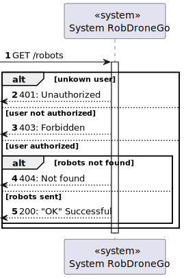
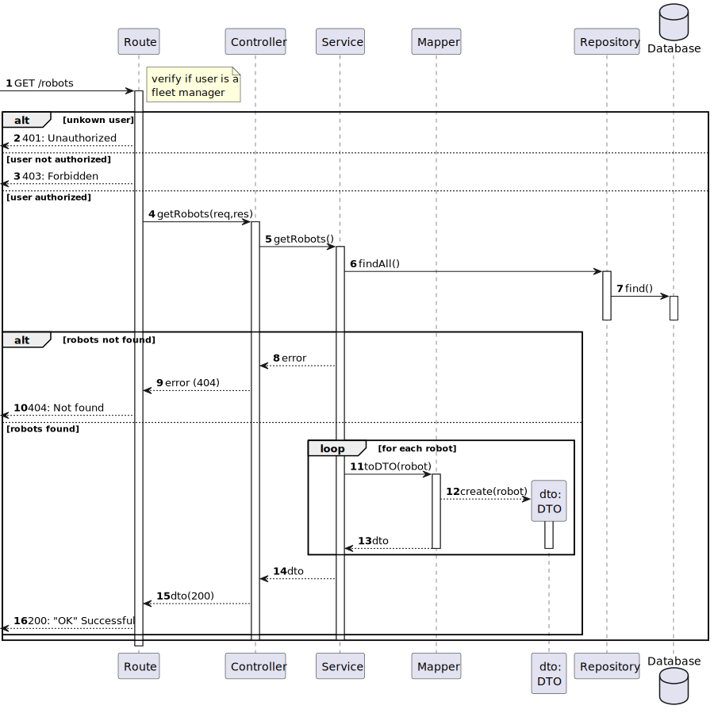
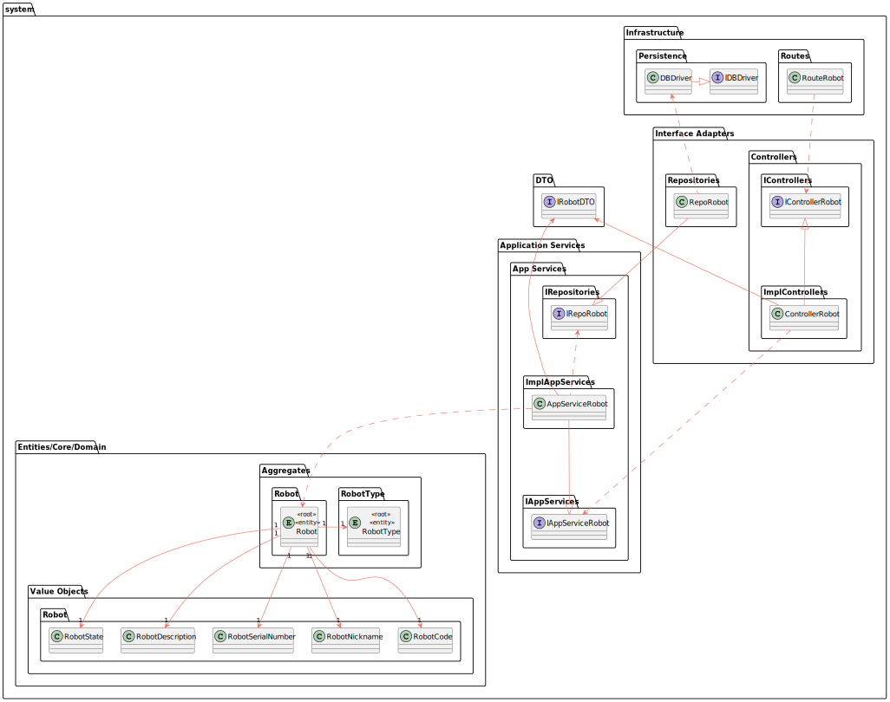

# US 380 - List robots

### 1. User Story Description

As a fleet manager, I intend to list all the fleet's robots

### 2. Customer Specifications and Clarifications

**From the specifications document:**

**From the client clarifications:**

No questions done to the client about this user story

### 3. Diagrams

### 4. HTTP

### 4.1 HTTP Requests

|  Method   |  HTTP request   |                      Description                      |
|:---------:|:---------------:|:-----------------------------------------------------:|
| getRobots | **GET** /robots | Robot Route calls method getRobots in robotController |

### 4.2 HTTP Response
| Status code |     Description     |
|:-----------:|:-------------------:|
|   **200**   |         OK          |
|   **401**   |    Unauthorized     |
|   **403**   |      Forbidden      |
|   **412**   | Precondition Failed |

### 4.3 Authorization

Authorization required : Fleet Manager

### 4.4 HTTP Request Body

For this user story , request body doesn't exist

### 4.5 Simulation HTTP requests

